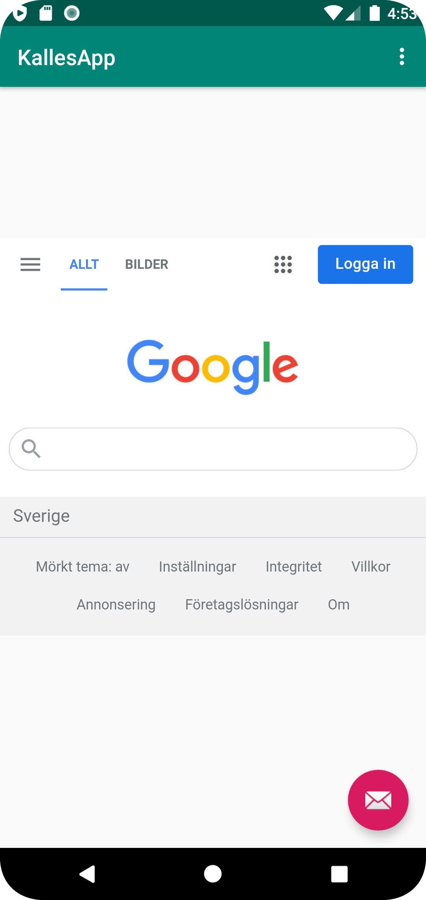

# Rapport
Jag bytte namn på appen, detta gjordes genom att "values". Andra saken jag gjorde på appen var att ge telefonen tillgång till nätverk, detta gjordes med hjälp av koden som man kan se i figur 1.
Efterdet skapades en webview som man kan se i figur 2. Tillsist la jag till webviewn i min mainactivity, jag hämta webviewn genom att hämta IDet som man kan se i 
figur 3. 

Det första jag gjorde var att framkalla både den externa länken samt den interna länken,
Jag gjorde också att när man öppnar den externa länken så kommer man till google och den interna
är en about.html.

```
<uses-permission android:name="android.permission.INTERNET" />   

```
Figur 1
```

    <WebView
    android:layout_width="match_parent"
    android:layout_height="match_parent"
    android:id="@+id/my_webView" />
```
Figur 2 
```
myWebView.setWebViewClient(my_WebClient);
              myWebView = findViewById(R.id.my_WebView);
              myWebView.getSettings().setJavaScriptEnabled(true);
```
Figur 3

## Följande grundsyn gäller dugga-svar:

- Ett kortfattat svar är att föredra. Svar som är längre än en sida text (skärmdumpar och programkod exkluderat) är onödigt långt.
- Svaret skall ha minst en snutt programkod.
- Svaret skall inkludera en kort övergripande förklarande text som redogör för vad respektive snutt programkod gör eller som svarar på annan teorifråga.
- Svaret skall ha minst en skärmdump. Skärmdumpar skall illustrera exekvering av relevant programkod. Eventuell text i skärmdumpar måste vara läsbar.
- I de fall detta efterfrågas, dela upp delar av ditt svar i för- och nackdelar. Dina för- respektive nackdelar skall vara i form av punktlistor med kortare stycken (3-4 meningar).

Programkod ska se ut som exemplet nedan. Koden måste vara korrekt indenterad då den blir lättare att läsa vilket gör det lättare att hitta syntaktiska fel.


Bilder läggs i samma mapp som markdown-filen.




Läs gärna:

- Boulos, M.N.K., Warren, J., Gong, J. & Yue, P. (2010) Web GIS in practice VIII: HTML5 and the canvas element for interactive online mapping. International journal of health geographics 9, 14. Shin, Y. &
- Wunsche, B.C. (2013) A smartphone-based golf simulation exercise game for supporting arthritis patients. 2013 28th International Conference of Image and Vision Computing New Zealand (IVCNZ), IEEE, pp. 459–464.
- Wohlin, C., Runeson, P., Höst, M., Ohlsson, M.C., Regnell, B., Wesslén, A. (2012) Experimentation in Software Engineering, Berlin, Heidelberg: Springer Berlin Heidelberg.
